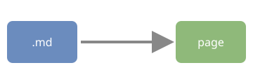

# Markdown sample

This file exercises what Simple Reader supports in Markdown. Its text is original and free to reuse.

## Text

Paragraphs are justified and hyphenated like books. **Bold**, *italic*, ~~strikethrough~~ and `inline code` work,
and so do [external links](https://github.com/OlegG90/simple-reader), which open in the browser,
and [links to headings](#tables-and-lists) inside the file.

> A quotation stands apart from the text around it.

## Tables and lists

| Format | Extension | Notes |
|---|---|---|
| EPUB | `.epub` | Paginated by default |
| FB2 | `.fb2`, `.fb2.zip` | UTF-8 or windows-1251 |
| Markdown | `.md` | Scrolled by default |

### Task list

- [x] Render GitHub-flavored Markdown
- [x] Build the contents from headings
- [ ] Keep reading

### Numbered list

1. Open a file
2. Read it
3. Close the window; the position is kept

## Code

Code blocks keep a monospace font and are not highlighted:

```ts
function greet(name: string) {
  return `Hello, ${name} <3`
}
```

## Images

An image next to the file, loaded by a relative path:



## Українська

Кирилиця в UTF-8 відображається без жодних налаштувань, а заголовок потрапляє до змісту.
